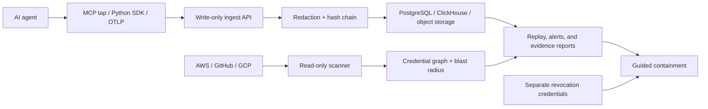

# Leaflyst

[](https://github.com/ShreyanshVaibhaw/Leaflyst/actions/workflows/ci.yml)

**The flight recorder and credential graph for AI agents.**

Leaflyst creates an independent, tamper-evident record of agent activity and
maps the credentials, permissions, and resources an agent can reach. When an
incident happens, teams can reconstruct the timeline, measure the blast radius,
and follow a guided containment workflow without trusting the agent's own logs.

## Why Leaflyst

Traditional application logs are often produced by the same agent being
investigated. Leaflyst records out of band through an MCP tap, Python SDK, or
OTLP endpoint, then redacts sensitive payloads and hash-chains the event stream.

- Replay agent sessions with integrity and gap verification.
- Scan AWS, GitHub, and Google Cloud using read-only identities.
- Connect agents, credentials, permissions, and resources in a credential graph.
- Evaluate blast radius before taking containment action.
- Export evidence that can be verified without a running Leaflyst service.

## Core capabilities

| Area | Included |
| --- | --- |
| Flight recorder | MCP tap, Python SDK, OTLP ingest, payload redaction, hash-chained events, replay |
| Credential graph | Read-only AWS, GitHub, and GCP scanning with credential and permission reach |
| Detection | Rule-based anomalies, recording-gap detection, Slack and email alerts |
| Response | Blast-radius analysis, incident reports, guided revocation with separate credentials |
| Operations | Multi-tenant dashboard, usage controls, public isolated demo, standalone evidence verifier |

## How it works



## Security model

- Recording uses write-only ingest tokens; agents cannot read or rewrite history.
- Secret values are never stored in the credential graph.
- Payloads are redacted before storage and encrypted with per-payload data keys.
- Scanner credentials are read-only and never reused for revocation.
- Tap and SDK failures degrade recording without blocking the agent.
- Captured agent input and output is always treated as untrusted content.

## Layout

```
apps/api           FastAPI: ingest, app API, chain verification
apps/web           Next.js dashboard
packages/schemas   Canonical event schema (JSON Schema) + generated Pydantic/TS types
packages/abx-sdk   Python SDK (LangGraph instrumentor)
packages/abx-tap   MCP tap CLI
services/scanner   Credential scanner workers (AWS, GitHub, Google Cloud)
services/rules     Anomaly rule engine + alerts
infra              docker compose, migrations, DDL
demo               End-to-end demo scenario
tools/abx_verify.py Standalone standard-library evidence verifier
```

## Quick start

Requirements: Python 3.12, [uv](https://docs.astral.sh/uv/), Node.js 24,
[pnpm](https://pnpm.io/), and Docker.

```bash
uv sync --all-packages
pnpm -C apps/web install
docker compose -f infra/docker-compose.dev.yml up -d
uv run python infra/migrate.py
```

Start the API and dashboard in separate terminals:

```bash
uv run uvicorn abx_api.main:app --reload
pnpm -C apps/web dev
```

Open [http://localhost:3000/onboarding](http://localhost:3000/onboarding) to
create a workspace and its write-only ingest token. The public PocketOS demo is
available at [http://localhost:3000/demo](http://localhost:3000/demo) when
`ABX_DEMO_ENABLED=true`.

Run the complete local checks:

```bash
uv run pytest
uv run ruff check . && uv run mypy
uv run python packages/schemas/scripts/codegen.py --check
uv run python packages/schemas/scripts/api_contracts.py --check
pnpm -C apps/web lint
pnpm -C apps/web test
pnpm -C apps/web exec tsc --noEmit
pnpm -C apps/web build
```

## Release images

The API, migration runner, scanner worker, and alert worker share one locked,
non-root Python image. The standalone Next.js image includes the matching
Playwright Chromium runtime used for incident-report PDFs:

```text
docker build -f infra/docker/python.Dockerfile -t leaflyst-python:local .
docker build -f infra/docker/web.Dockerfile -t leaflyst-web:local .
uv run python demo/container_smoke.py
```

The smoke check rejects root images and configured secrets, then verifies both
container health checks, the public security page, and the packaged Chromium
binary. Runtime credentials must be injected by the deployment platform. See
[`docs/deployment.md`](docs/deployment.md) for the one-command release topology.

## Dashboard and onboarding

The server-rendered dashboard reads data without exposing the API admin key to
the browser:

```text
ABX_API_URL=http://localhost:8000
ABX_ADMIN_KEY=dev-admin-key
```

Open `/onboarding` to create a workspace and receive a write-only ingest token.
`ABX_TENANT_ID` remains available as a local-development fallback. See
[`docs/onboarding.md`](docs/onboarding.md) for the cold-start and production
path and [`docs/integrations.md`](docs/integrations.md) for tap, SDK, OTLP,
AWS, local-scanner, GitHub, and Google Cloud setup.

Daily recording limits are assigned from the operator environment until a
payment control plane is connected:

```text
uv run python -m abx_api.admin set-plan <tenant-id> <plan-key> <daily-events|unlimited> [per-token-payloads|unlimited]
```

Crossing a configured limit does not reject recording. Events remain redacted,
digested, chained, and indexed. Aggregate tenant/day counts drive plan reporting;
the separate optional argument controls each write-only token's independent
payload allowance. An exhausted token switches to metadata-only without degrading
other recorders.

For the GitHub App connection flow, set `ABX_GITHUB_APP_SLUG`,
`ABX_GITHUB_APP_ID`, `ABX_GITHUB_PRIVATE_KEY`, and a production
`ABX_GITHUB_STATE_SECRET`. Configure the App setup URL as
`<API URL>/v1/integrations/github/setup`, then run the scanner worker with
`uv run abx-scanner-worker`. Provider secrets stay in the API/worker
environment; PostgreSQL stores installation identifiers only.

Google Cloud scanning uses Application Default Credentials only inside the
scanner worker. Set `ABX_GCP_SCANNER_PRINCIPAL` to the hosted IAM member, grant
the read roles listed on the Integrations page, and enter a project ID to queue
the first scan. Jobs store only project identifiers; the graph stores
service-account key IDs and IAM reach, never token or private-key material.

## Python SDK and OTLP

LangGraph uses the standard callback configuration:

```python
from abx import instrument
callback = instrument(agent_id="billing-bot")
result = graph.invoke(inputs, {"callbacks": [callback]})
```

Set `ABX_INGEST_TOKEN` and optionally `ABX_OTLP_ENDPOINT` (default:
`http://localhost:8000/v1/otlp/traces`). Message content is disabled by
default; opt in with `OTEL_INSTRUMENTATION_GENAI_CAPTURE_MESSAGE_CONTENT=true`.
Call `callback.shutdown()` during application shutdown to flush buffered spans.

Existing OTLP exporters can send protobuf traces to `/v1/otlp/traces` with the
write-only ingest token in the `Authorization: Bearer ...` header. Current and
legacy OTel GenAI, OpenLLMetry, and OpenInference attributes are normalized.

## Alerts and containment

Run `uv run abx-alert-worker` to evaluate queued events without adding work to
the recording path. Slack and email delivery use deployment secrets
`ABX_SLACK_WEBHOOK_URL` and `ABX_RESEND_API_KEY`; the dashboard stores only
non-secret channel settings and email recipients.

Revocation never reuses scanner credentials. AWS containment requires the
separate `ABX_AWS_REVOKE_ACCESS_KEY_ID` and
`ABX_AWS_REVOKE_SECRET_ACCESS_KEY` identity, restricted to
`iam:UpdateAccessKey` and `iam:DeleteAccessKey` using
`infra/aws/revoker-policy.yaml`. GitHub containment uses the separate
`ABX_GITHUB_REVOKE_TOKEN` with Personal access tokens write and repository
Administration write. Warm credentials remain guided-only regardless of
configuration. Google Cloud service-account keys are guided-only in this phase:
the impact screen generates disable/delete commands, while the GET-only scanner
identity has no write adapter.
